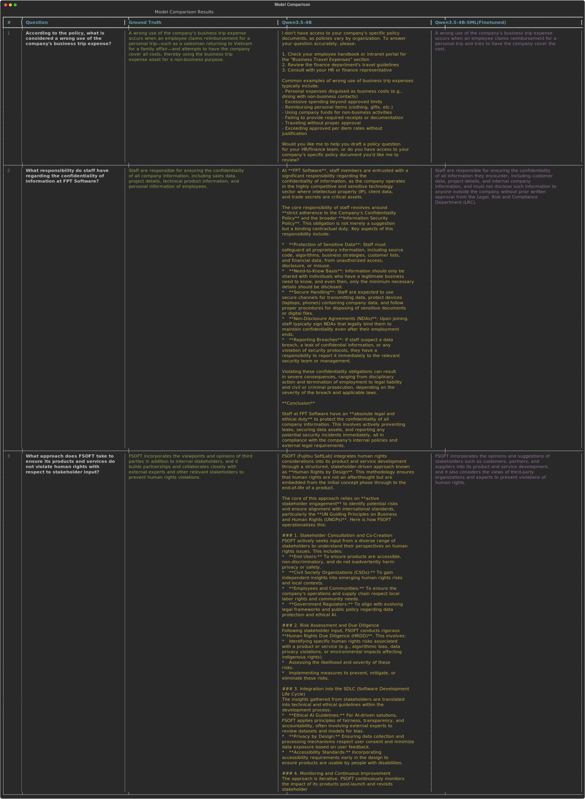

# SML — Small Language Model Fine-tuning Pipeline



Converts internal PDF documents into QA training data and fine-tunes a small language model.

```
PDF → Markdown (MinerU) → Chunks → Filtered Chunks → QA Pairs → Training (ms-swift LoRA)
```

---

## Stage 1 — PDF to Markdown (MinerU)

Converts PDFs to structured markdown using the MinerU API.

**Start single-GPU API:**
```bash
cd src/preprocessing_pdf/mineru
./start_api.sh                        # default: http://0.0.0.0:8000
HOST=127.0.0.1 PORT=8000 ./start_api.sh
```

**Start multi-GPU router:**
```bash
CUDA_VISIBLE_DEVICES=0,1,2,3 ./start_router.sh   # default: http://0.0.0.0:8002
```

**Run batch client:**
```bash
python mineru/mineru_client.py \
  --input-dir /path/to/pdfs \
  --output-dir /path/to/output_batches \
  --server-url http://127.0.0.1:8000 \
  --chunk-size 50 \
  --backend pipeline \
  --metadata-path /path/to/output_batches/metadata/all_batches.json
```

**Output layout:**
```
output_batches/
  batch_0001/
    papers/
      DOCUMENT_NAME/
        DOCUMENT_NAME.md
        result.json
    metadata/
      batch_0001_metadata.json
```

---

## Stage 2 — Parsing (`parse.py`)

Splits markdown files into content chunks using heading-based chunking (paragraph-based fallback). Chunks below `--min-words` are merged into the previous chunk rather than discarded.

```bash
python -m src.preprocessing_pdf.parse \
  --mode batches-parallel \
  -i /path/to/output_batches \
  --min-words 50 \
  --workers 5
```

| Argument | Default | Description |
|---|---|---|
| `--mode` | `batches-parallel` | `single`, `folder`, `batches`, `batches-parallel` |
| `-i` / `--input-dir` | required | Base directory of batch folders |
| `--min-words` | `50` | Minimum words per chunk; smaller chunks merge into previous |
| `--paragraph-window` | `3` | Paragraphs per window (fallback mode) |
| `--paragraph-overlap` | `1` | Overlap between windows (fallback mode) |
| `-w` / `--workers` | `5` | Parallel workers (batches-parallel mode) |
| `--batch-start` | `1` | First batch number to process |
| `--batch-end` | — | Last batch number to process |

Output: `*_chunks_raw.jsonl` alongside each markdown file.

---

## Stage 3 — Chunk Filtering (`chunk_filter_openrouter.py`)

Filters out low-quality chunks using a binary yes/no LLM evaluation. Two backends are available.

Uses any OpenRouter-compatible model.

```bash
export OPENROUTER_API_KEY=...
python -m src.preprocessing_pdf.chunk_filter_openrouter \
  --mode batches \
  -i /path/to/output_batches \
  --model openai/gpt-oss-120b:free \
  --max-concurrent 10 \
  --batch-start 1
```

| Argument | Default | Description |
|---|---|---|
| `--mode` | `batches` | `file`, `folder`, `batches` |
| `-i` / `--input-dir` | required | Base directory of batch folders |
| `--model` | see above | Model identifier |
| `--max-concurrent` | `10` | Maximum concurrent API calls |
| `--batch-start` / `--batch-end` | `1` / — | Batch range |

Output: `*_chunks.jsonl` (filtered) alongside each `*_chunks_raw.jsonl`.

---

## Stage 4 — QA Generation (`qa_generator.py`)

Generates question-answer pairs from filtered chunks. The number of questions scales adaptively with chunk size: `n = max(1, min(max_questions, word_count // 100))`.

```bash
export OPENROUTER_API_KEY=...
python -m src.preprocessing_pdf.qa_generator \
  --mode batches \
  -i /path/to/output_batches \
  --model openai/gpt-oss-120b:free \
  --max-questions 5 \
  --max-concurrent 10 \
  --batch-start 1
```

| Argument | Default | Description |
|---|---|---|
| `--mode` | `batches` | `file`, `folder`, `batches` |
| `-i` / `--input-dir` | required | Base directory of batch folders |
| `--model` | `openai/gpt-oss-120b:free` | OpenRouter model identifier |
| `--max-questions` | `5` | Maximum questions per chunk |
| `--max-concurrent` | `10` | Maximum concurrent API calls |
| `--enable-reasoning` | off | Enable chain-of-thought reasoning |
| `--batch-start` / `--batch-end` | `1` / — | Batch range |

Output: `*_qa.jsonl` alongside each `*_chunks.jsonl`.

---

## Stage 5 — Prepare Training Dataset (`prepare_dataset_swift.py`)

Convert generated QA pairs to ms-swift training format:

```bash
python -m src.train.prepare_dataset_swift \
  -i /path/to/output_batches \
  -o /path/to/training_data.jsonl
```

Accepts either a single `*_qa.jsonl` file or a directory (auto-collects all `*_qa.jsonl` recursively).

Output format:
```json
{"messages": [
  {"role": "system", "content": "You are a helpful assistant..."},
  {"role": "user", "content": "<question>"},
  {"role": "assistant", "content": "<answer>"}
]}
```

---

## Stage 6 — LoRA Fine-tuning

Fine-tunes a model using ms-swift LoRA SFT.

**Kaggle / Colab:** use [`src/train/sml_training_kaggle.ipynb`](src/train/sml_training_kaggle.ipynb) for a fully self-contained notebook (tested on 2× T4).

**Server / CLI:** paths are configurable via environment variables.

```bash
DATASET=/path/to/training_data.jsonl \
OUTPUT_DIR=/path/to/train/output \
bash src/train/lora_sft.sh
```

| Variable | Default | Description |
|---|---|---|
| `DATASET` | `/root/code/dataset.jsonl` | Path to training JSONL |
| `OUTPUT_DIR` | `/root/code/train/output` | Checkpoint output directory |

Key hyperparameters:

| Parameter | Value |
|---|---|
| Model | `Qwen/Qwen3.5-4B` |
| LoRA rank / alpha | `32` / `64` |
| Batch size | `4` (× 4 gradient accumulation steps) |
| Max length | `512` |
| Learning rate | `2e-4` |
| Epochs | `6` |
| Attention | `sdpa` |
| Loss scale | `default` (set to `ignore_empty_thinking` for thinking models) |

---

## Stage 7 — Merge LoRA Adapter (`src/train/merge.sh`)

Merges the trained LoRA adapter into the base model weights.

```bash
CHECKPOINT=/path/to/train/output/checkpoint-XXXX \
bash src/train/merge.sh
```

| Variable | Default | Description |
|---|---|---|
| `CHECKPOINT` | `/root/code/train/output/checkpoint-last` | Path to LoRA checkpoint |
